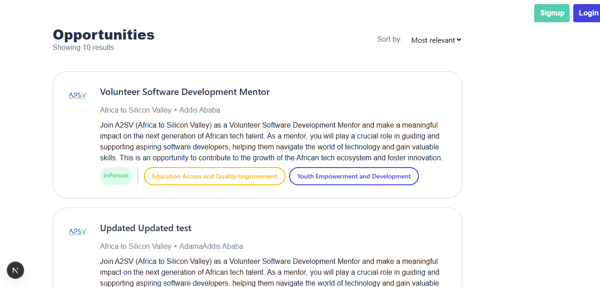
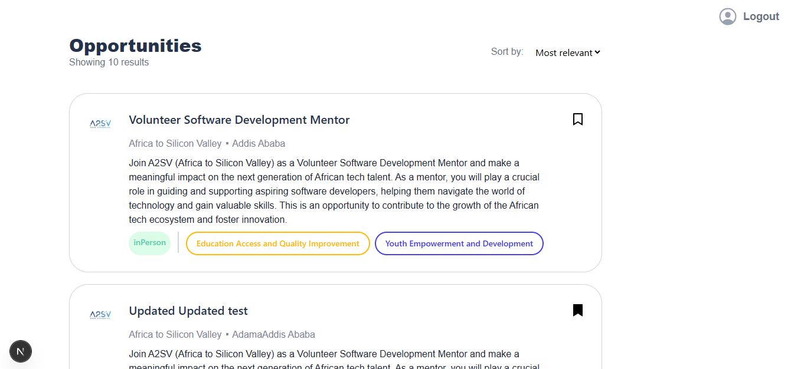
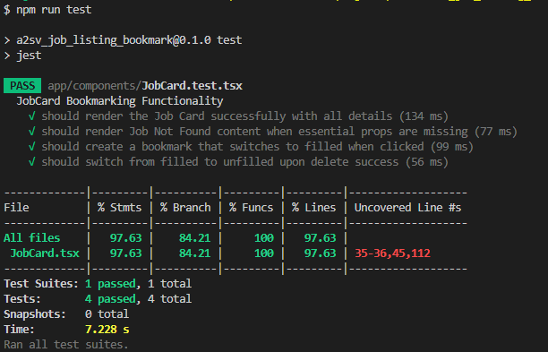

# Job Bookmarking App

A full-stack job listing and bookmarking web application built with **Next.js**, **React**, **Redux Toolkit (RTK Query)**, and **Spring Boot** backend. The application allows users to browse job opportunities, bookmark their favorite jobs, and manage bookmarks.

---

## Features

- Browse job opportunities fetched from a backend API
- Bookmark and unbookmark jobs
- View bookmarked jobs on a separate page
- Responsive design for desktop and mobile
- Error handling and loading states
- Client-side state management with Redux Toolkit
- Integration with Spring Boot backend API

---

## Tech Stack

- **Frontend:** Next.js, React, TypeScript, Redux Toolkit (RTK Query), React Icons
- **Backend:** External API calls
- **Testing:** Cypress (End-to-End), Jest
- **Styling:** Tailwind CSS
- **Image Handling:** Next.js Image component

## Getting Started

First, run the development server:

```bash
npm run dev
```

Open [http://localhost:3000](http://localhost:3000) with your browser to see the result.

## Screenshots

- HomePage (pre-login) 

- HomePage (post-login) 

- Jest Test Result 

- Cypress Test Result 
